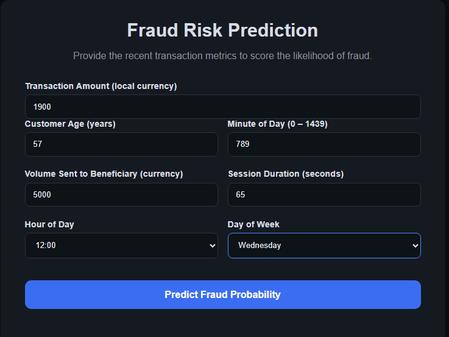

# Fraud Detection ML Project

## Project Structure

- artifacts/  
  - model.pkl  
  - preprocessor.pkl  
  - encoder.pkl  
  - schema.json  
  - feature_columns.json  

- src/  
  - components/  
    - data_ingestion.py  
    - data_transformation.py  
    - model_trainer.py  
  - pipeline/  
    - predict_pipeline.py  
  - utils.py  
  - exception.py  

- templates/  
  - home.html  
  - index.html  

- app.py (Streamlit app)  
- main.py (Flask application for predictions)  
- requirements.txt  
- README.md

## Features
- Handles numeric and categorical transaction features.
- Preprocessing includes scaling numeric features and one-hot encoding categorical features.
- Supports multiple ML models with AUC evaluation.
- Deployment-ready via Flask or Streamlit web app.
- Provides user-friendly interface for fraud prediction.

## Technologies Used
- Python 3.13
- pandas, numpy, scikit-learn
- Flask (web deployment)
- Streamlit (optional web deployment)
- joblib / pickle for model serialization
- HTML/CSS for web templates

## Installation
1. Clone the repository:
```bash
git clone <repository_url>
cd Fraud-Detection
```
2. Create a virtual environment and activate it:
```bash
python -m venv venv
venv\Scripts\activate       
source venv/bin/activate    
```
3. Install dependencies:
```bash
pip install -r requirements.txt
```
## Usage
## Flask Web App
1. Ensure main.py and home.html are in place.
2. Run the Flask app:
```bash
python main.py
```


3. Open the browser at: http://127.0.0.1:5000
4. Fill in the transaction details and submit to get fraud prediction.

## Streamlit Web App (Optional)
1. Run the Streamlit app:
```bash
streamlit run app.py
```
2. The app opens in a browser with a similar input form.

## How It Works
1. Data Input: Users provide transaction features (amount, customer age, session duration, time features, etc.).
2. Preprocessing: Numeric columns are scaled, categorical columns are encoded.
3. Prediction Pipeline:
   - Features are aligned to match training.
   - Model predicts 0 (Not Fraud) or 1 (Fraud).
4. Output: Web interface displays prediction result and probability.

## Model Evaluation
- Models evaluated using AUC-ROC on training and test data.
- Best-performing model saved in artifacts/model.pkl.

## Next Steps:
1. Model Deployment using AWS Beanstalk
2. Deployment EC2 instance with ECR
